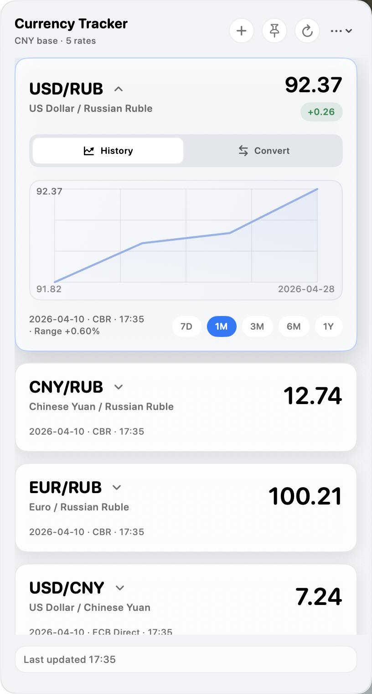
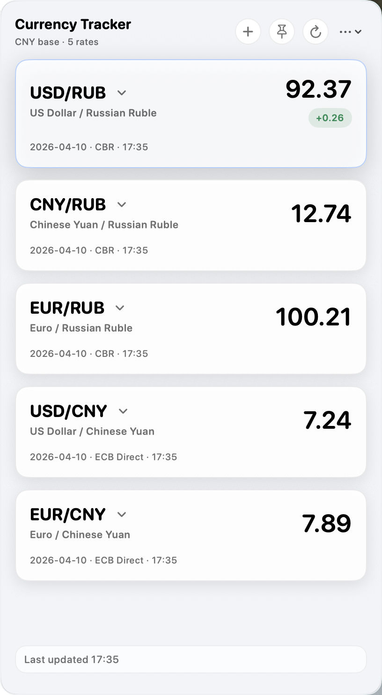
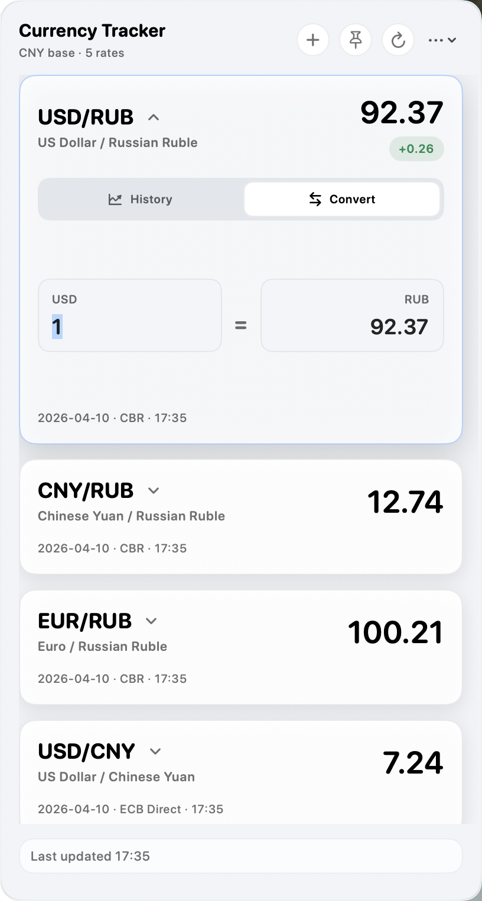
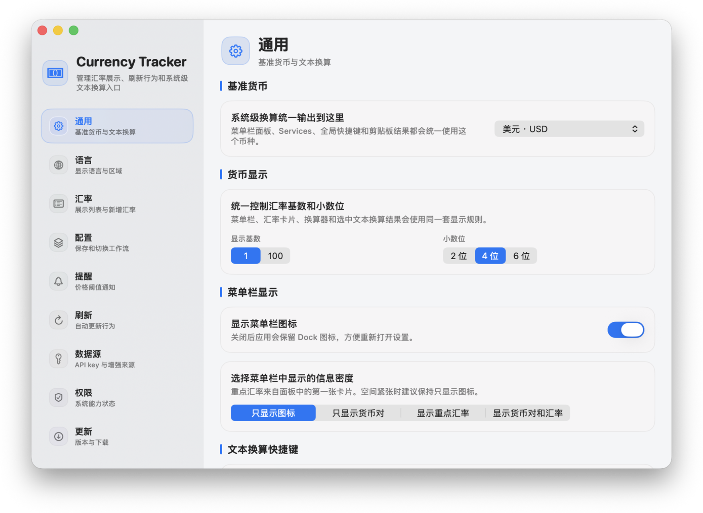
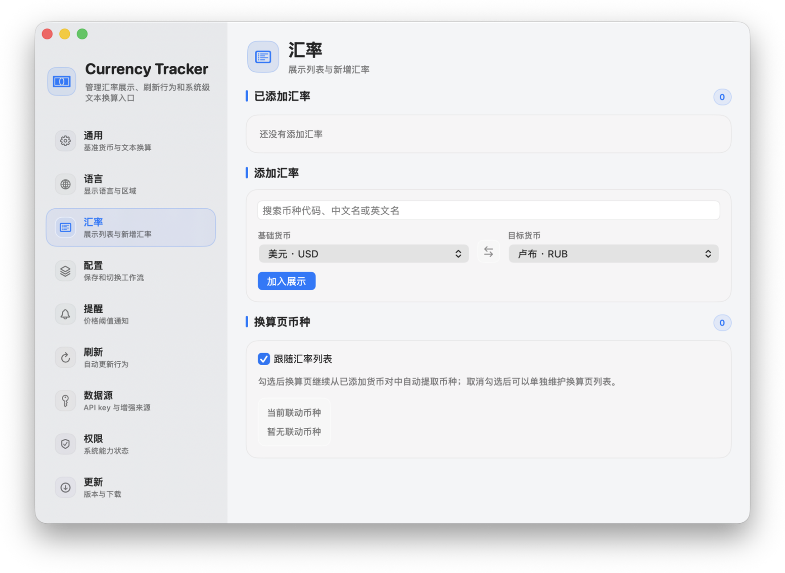
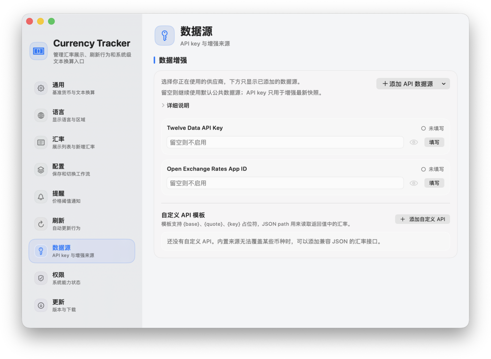
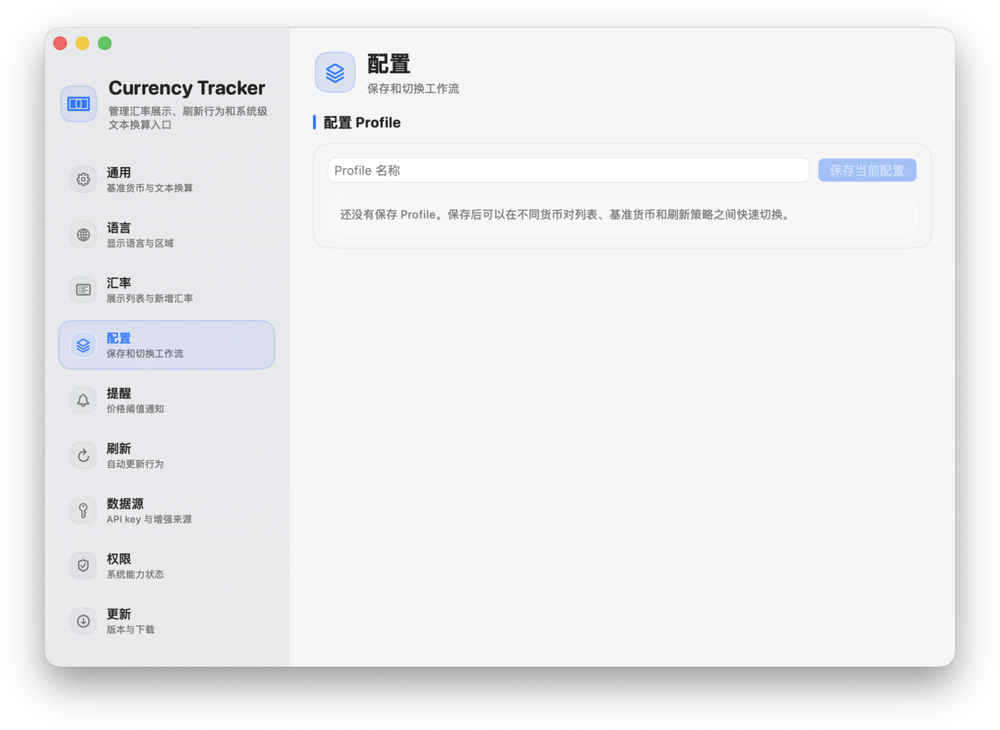
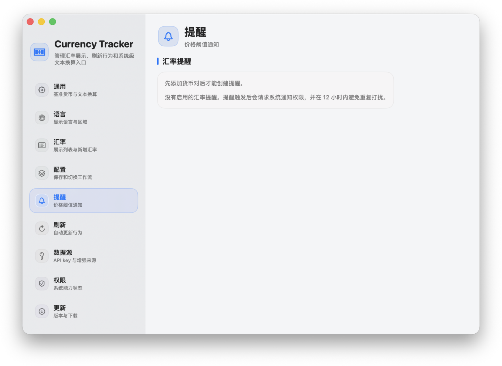
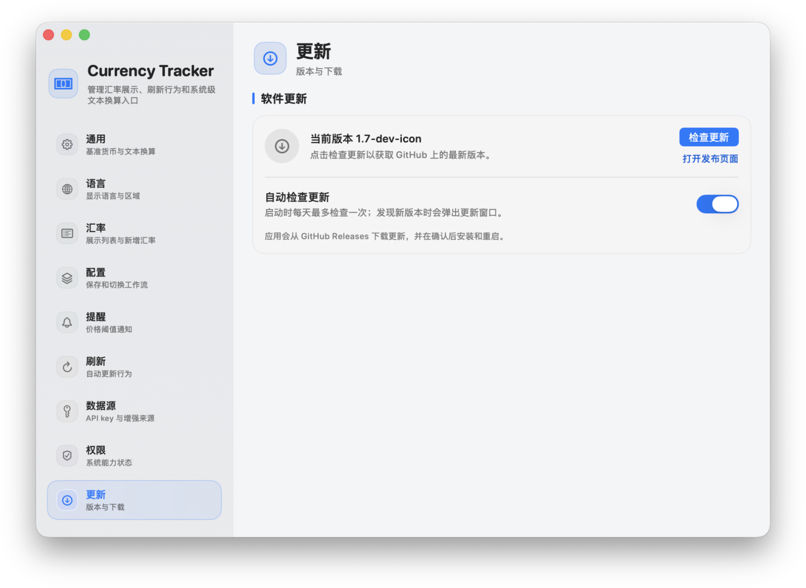

# Currency Tracker

  <a href="README.md">English</a>
  ·
  <strong>简体中文</strong>
  ·
  <a href="README.ru.md">Русский</a>

Currency Tracker 是一款 macOS 菜单栏汇率工具，支持实时汇率查看、快速换算，以及对其他应用中选中文本进行系统级货币换算。它适合经常关注少量货币对、并希望所有操作都尽量停留在菜单栏附近的用户。

  <a href="https://github.com/Agumuzi/Currency-Tracker/releases/latest"><strong>下载最新版本</strong></a>
  ·
  <a href="https://agumuzi.github.io/Currency-Tracker/">产品页面</a>
  ·
  <a href="https://github.com/Agumuzi/Currency-Tracker/releases">发布记录</a>

  

## 功能概览

- 将常用汇率货币对放在 macOS 菜单栏中，点击即可查看。
- 可在设置中显示或隐藏菜单栏图标，并暂停后台活动。
- 用紧凑卡片显示最新汇率、数据来源、刷新时间，以及涨跌变化标记。
- 每张卡片都可以展开为历史走势图或双向换算器。
- 菜单栏面板可在汇率列表和多币种换算器之间切换。
- 支持按 `1 BASE` 或 `100 BASE` 展示汇率，并可固定为 2、4 或 6 位小数。
- 可从受数据源支持的 ISO 货币目录中添加、移除、排序和搜索货币对。
- 可通过 macOS 服务或全局快捷键换算其他应用中的选中文本。
- 支持英文、简体中文、繁体中文、俄语、日语、韩语、法语、德语、西班牙语、巴西葡萄牙语和意大利语。
- 偏好设置和 API 凭据保存在本机，不使用系统钥匙串。

## 截图

### 菜单栏工作流

| 汇率列表 | 历史图表 | 内联换算 |
| --- | --- | --- |
|  |  |  |

### 设置与配置

| 欢迎页 | 汇率 | 数据源 |
| --- | --- | --- |
|  |  |  |

| 配置档案 | 提醒 | 更新 |
| --- | --- | --- |
|  |  |  |

## 主要功能

### 菜单栏汇率

选择你关心的货币对，并将它们放在紧凑的菜单栏面板中。面板支持列表较长时滚动、置顶显示、手动刷新、菜单栏项目显示模式，以及在保留 Dock 访问入口的同时隐藏菜单栏图标。

### 历史与换算

每张汇率卡片都可以在面板内展开为近期走势图或换算器，不需要离开当前界面。菜单栏面板还提供独立的换算器页面，会根据已配置货币自动生成去重后的货币列表。在有历史数据时，图表范围支持 7 天、1 个月、3 个月、6 个月和 1 年。

### 货币对管理

设置窗口包含侧边栏，以及通用行为、语言、汇率货币对、换算器货币、配置档案、提醒、刷新策略、数据源、权限、更新、诊断和系统启动行为等独立页面。换算器货币可以跟随已选汇率货币对，也可以单独管理；后台活动可以暂停，而不影响手动刷新。

### 语言与窗口行为

应用遵循 macOS 的单个应用语言偏好，并提供语言页面，可直接打开系统的“语言与地区”设置。菜单栏面板会锚定在状态栏图标附近；置顶面板和设置窗口可调整大小，以适配更长的货币列表或本地化文本。

### 数据源

Currency Tracker 默认可使用公开备用数据源。对个人使用来说，推荐增强数据源是 [Twelve Data](https://twelvedata.com/) 和 [Open Exchange Rates](https://openexchangerates.org/)，因为两者都提供免费层级：Twelve Data 每天提供 800 个免费 API credit，约等于 Currency Tracker 中 100 次完整的多货币对刷新；Open Exchange Rates 每月提供 1,000 次免费请求。

你也可以在需要更广覆盖或更高稳定性时，为其他主流服务商添加凭据：

- [Twelve Data](https://twelvedata.com/)
- ExchangeRate-API
- [Open Exchange Rates](https://openexchangerates.org/)
- Fixer
- Currencylayer
- 支持 `{base}`、`{quote}` 和 `{key}` 占位符的自定义 JSON API 模板，包含安全输入、启用/编辑状态和内置连接测试

### 配置档案与提醒

你可以把不同的货币对列表和刷新设置保存为配置档案，并根据不同使用场景快速切换。汇率提醒可以监听选中的货币对，并在触发阈值时请求通知权限。

### 更新

应用可以在设置中检查 GitHub Releases。更新包会在用户确认后下载、校验 SHA256、准备安装、替换应用、重新启动并清理临时文件。由于应用没有使用 Apple Developer ID 签名，也没有经过 Apple 公证，替换应用后，macOS 的隐私权限例如辅助功能权限可能需要重新检查；如果应用检测到原先授予的权限不再有效，会在应用内更新后打开“权限”页面。

## 当前版本

版本 `1.6.2` 包含：

- 修复菜单栏面板位置，使弹窗保持在 macOS 菜单栏下方，不再贴到屏幕顶部而被裁切。
- 在设置中加入显示/隐藏菜单栏图标和暂停后台活动的控制项。
- 使用 AppKit 状态栏项目管理菜单栏可见性，避免动态 SwiftUI 菜单栏场景变化导致启动卡住。
- 在关闭后台活动时暂停定时刷新、自动更新检查和全局快捷键监听。
- 如果应用内更新后发现之前授予的系统权限需要重新检查，会打开“权限”设置页面。
- 在压缩前对完整 app bundle 进行 ad-hoc 签名，使发布资源包含密封资源和绑定的 bundle 元数据。

## 安装

从最新 GitHub Release 下载 `Currency-Tracker-1.6.2.zip`，解压后将 `Currency Tracker.app` 移动到“应用程序”文件夹。

应用通过 GitHub Releases 分发。它使用 ad-hoc 签名来保证 bundle 完整性，但没有使用 Apple Developer ID 签名，也没有经过 Apple 公证。首次启动时，macOS 可能会拦截。请打开：

`系统设置` -> `隐私与安全性` -> `仍要打开`

批准 `Currency Tracker`，然后确认“打开”。首次批准后，之后通常可以正常启动。手动更新或应用内更新替换 app 时，会保留现有的 Application Support 数据，但由于新的 app bundle 仍然不是 Developer ID 签名和公证版本，macOS 可能再次要求批准。系统隐私权限由 macOS 控制，应用无法静默恢复；如果更新后辅助功能、通知或登录项权限发生变化，请检查“设置”中的“权限”页面。

## 系统要求

- macOS 14.0 或更高版本
- 需要联网刷新实时汇率

## 隐私

Currency Tracker 以本地优先为原则。偏好设置、选中的货币对、刷新行为、配置档案、提醒和 API 凭据都保存在你的 Mac 上。服务商 Key 保存在应用本地的 Application Support 数据中，不写入 macOS 钥匙串。本项目不会把本地文件、剪贴板内容或设备数据上传到项目自有后端。

外部汇率服务商只会收到你启用的数据源所需的汇率请求。

## 许可证

Currency Tracker 基于 [MIT License](LICENSE) 发布。

## 链接

- [产品页面](https://agumuzi.github.io/Currency-Tracker/)
- [代码仓库](https://github.com/Agumuzi/Currency-Tracker)
- [发布记录](https://github.com/Agumuzi/Currency-Tracker/releases)
